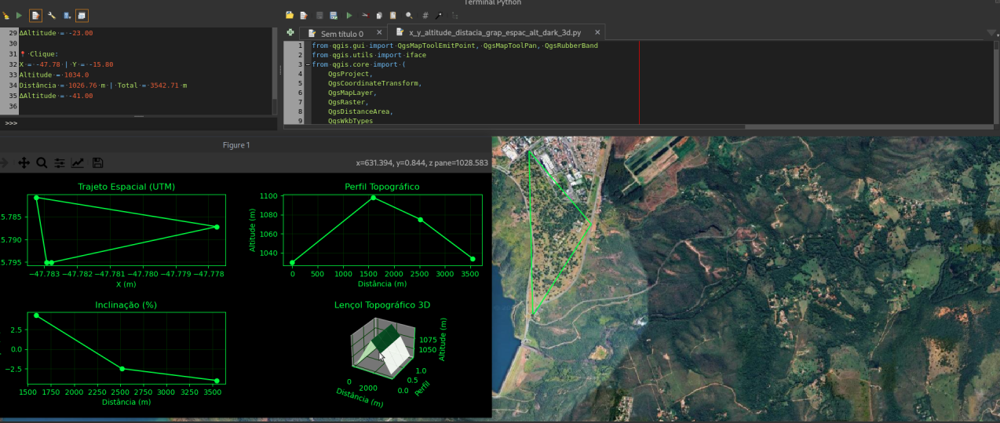
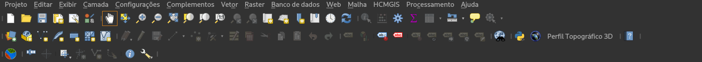
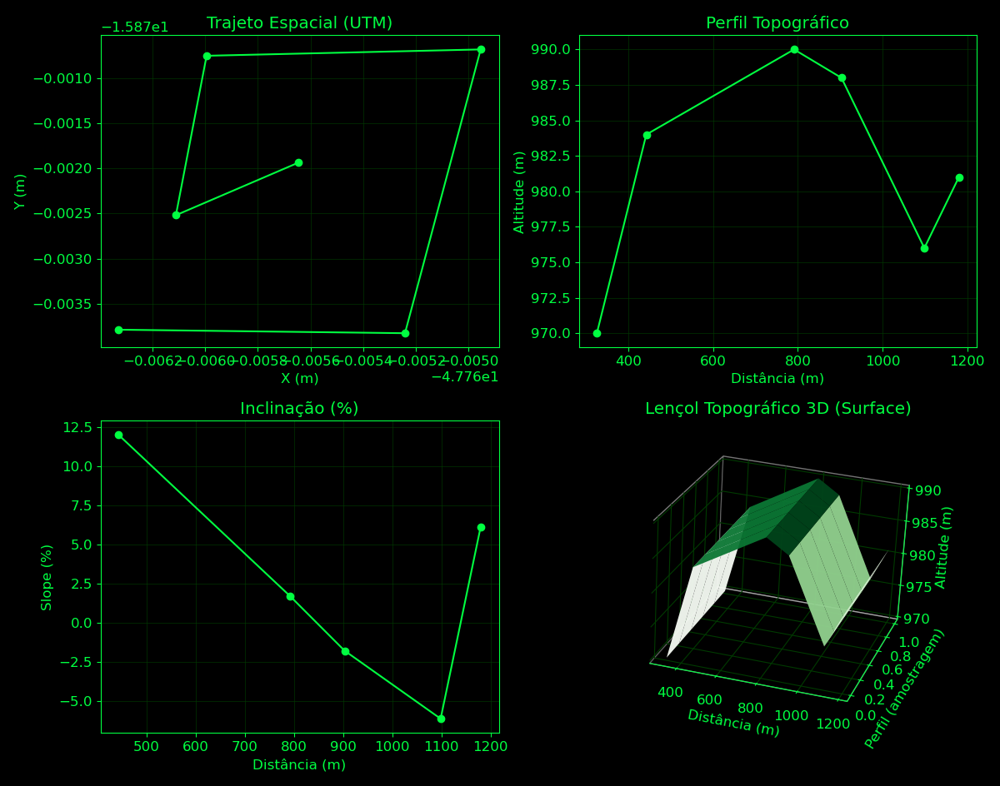
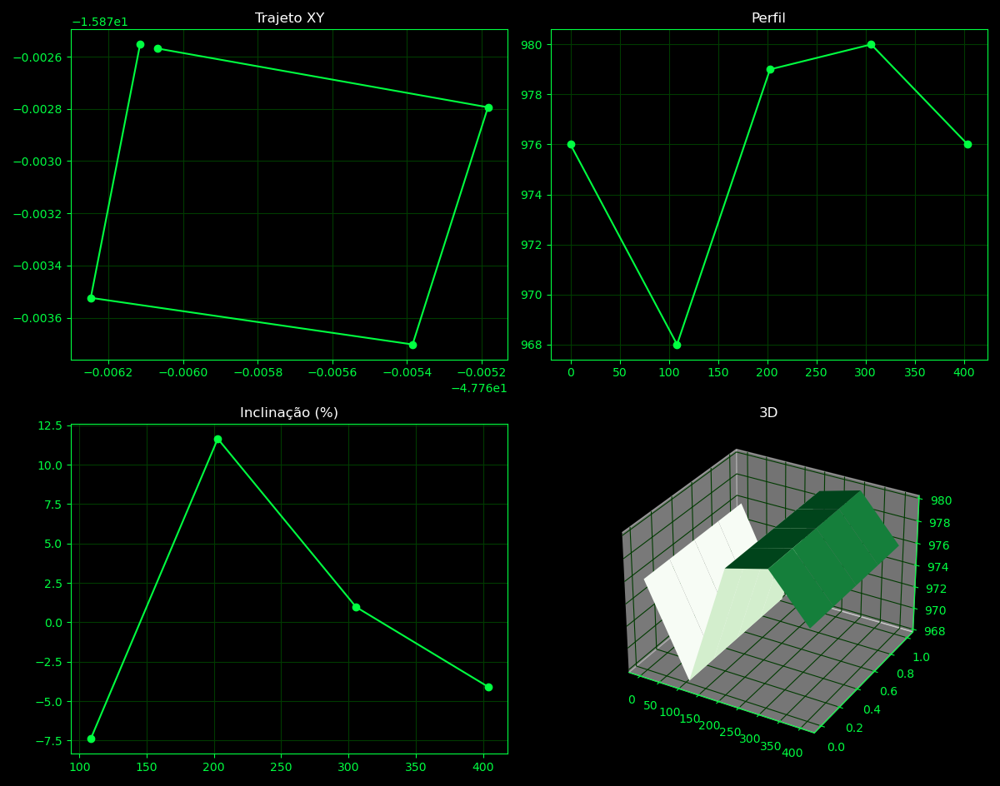

# qgis_perfil_topografico

Plugin para o QGIS desenvolvido em Python com PyQGIS para geração de perfis topográficos a partir de modelos digitais de elevação (DEM).

---

## Funcionamento no QGIS



---

## Barra de Ferramentas



---

## Perfil Topográfico Gerado



---

## Última Versão



---
## Funcionalidades

- Detecção automática de arquivos DEM
- Captura de pontos diretamente no mapa
- Leitura de altitude em tempo real
- Geração de perfil topográfico
- Integração com a interface do QGIS
- Reconhecimento automático de modelos SRTM carregados no projeto
- Geração de gráficos de elevação com base em dados raster `.tif/.tiff`

---

## Requisitos

Para funcionamento correto do plugin é necessário:

- Baixar um modelo digital de elevação (DEM)
- Carregar o arquivo raster no QGIS
- Utilizar arquivos SRTM compatíveis (`.tif` ou `.tiff`)

No exemplo deste projeto foi utilizado um modelo SRTM `.tiff`
disponibilizado pelo Centro de Ecologia da UFRGS.

---

## Tecnologias

- Python
- PyQGIS
- QGIS
- Raster DEM
- SRTM
- Matplotlib

---

## Estrutura do Projeto

```bash
.
├── barra_de_ferramentas.png
├── Grafico_1.png
├── Qgis_funcionamento.png
├── ultima_versao.png
├──  perfil_topografico.zip (arquivo pronto para exportar e subir plugin)
├── __init__.py
├── metadata.txt
├── perfil_topografico.py
├── plotter.py
├── tool.py
├── README.md
└── LICENSE
```

---

## Instalação

```bash
git clone https://github.com/Edions1/qgis_perfil_topografico.git
```

---

## Proposta da Versão 1.1

- Melhorar estrutura visual do plotter
- Refinar renderização dos gráficos
- Adicionar melhor interpretação dos eixos X, Y e Z
- Melhorar visualização das unidades de medida
- Otimizar leitura de altitude em grandes rasters
- Adicionar suporte a múltiplos perfis topográficos

---
## Licença

Este projeto está licenciado sob a GNU GPL v3.0.